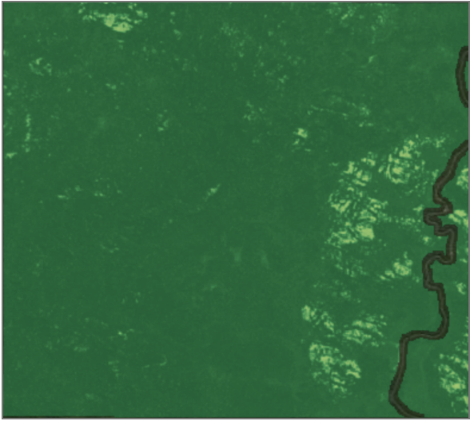
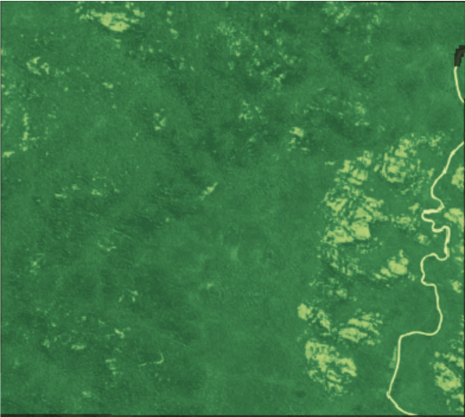
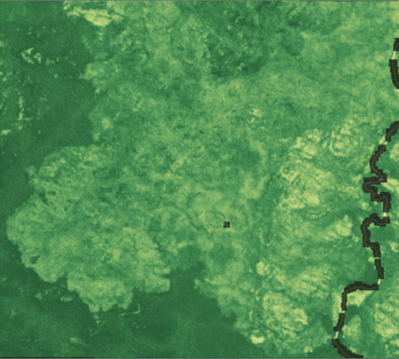

# Spatiotemporal Satellite Data Engine & Change Viewer

A high-throughput satellite data pipeline and interactive visualization dashboard for environmental trend modeling.

## Example Output

| Observation Window | Trend Observation |
|---|---|
| **2016** | High-density vegetation |
| **2024** | Minor visible index deviation |
| **2025** | Significant delta (Δ) attributed to environmental trend |

  
  
  

  <em>Temporal index progression — 2016 → 2024 → 2025</em>

---

## Features

- **Distributed Data Pipeline:** Executes parallel temporal matrix reductions across multi-gigabyte satellite array datasets (Landsat 5–9, Sentinel-2).
- **Lazy Cloud Streaming:** Ingests STAC data cubes dynamically via the Microsoft Planetary Computer API to eliminate heavy local storage requirements.
- **Automated QA Masking:** Applies dataset-specific scale/offset transformations while masking cloud, water, snow, and shadow artifacts using QA/SCL bands.
- **Optimized Storage & Spatial Indexing:** Stores processed spatial points and metadata in PostgreSQL with spatial indexing and partitioning for accelerated trend query performance.
- **Interactive Web Dashboard:** Asynchronous FastAPI backend paired with a React/TypeScript interface to dynamically query database layers and render real-time visual analytics.

---

## Tech Stack

**Languages:** Python, TypeScript  
**Core Pipeline:** Dask, StackSTAC, Xarray, RioXarray, Rasterio, GeoPandas, NumPy  
**Database:** PostgreSQL (PostGIS)  
**Backend & Frontend:** FastAPI, React / Next.js, Leafmap, Matplotlib  
**Data Sources:** Microsoft Planetary Computer STAC API
