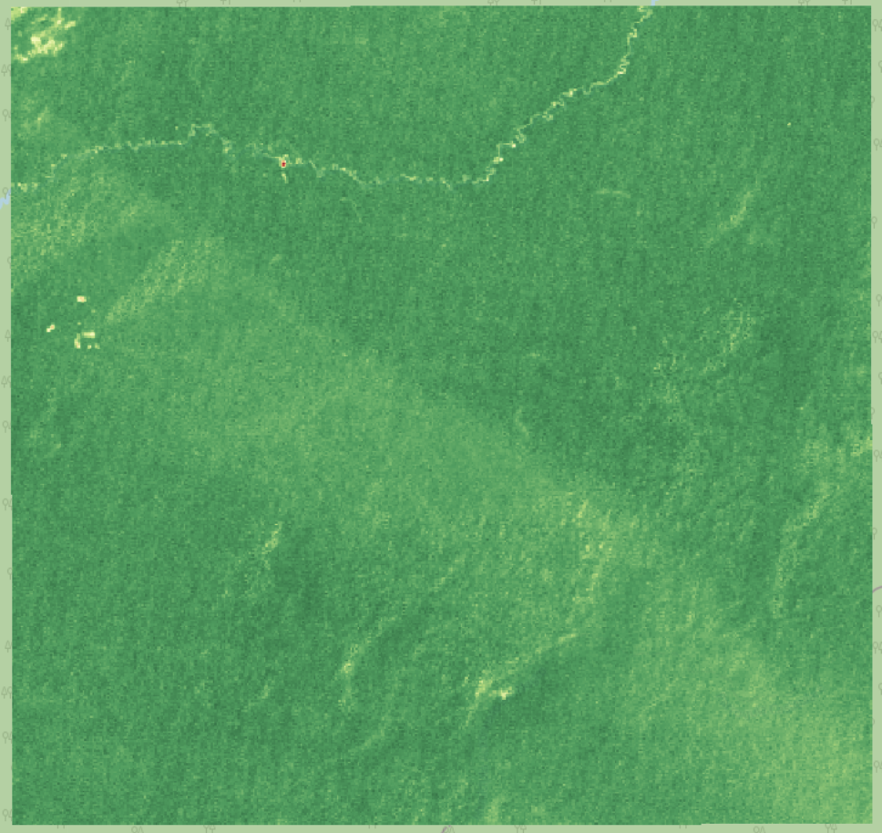
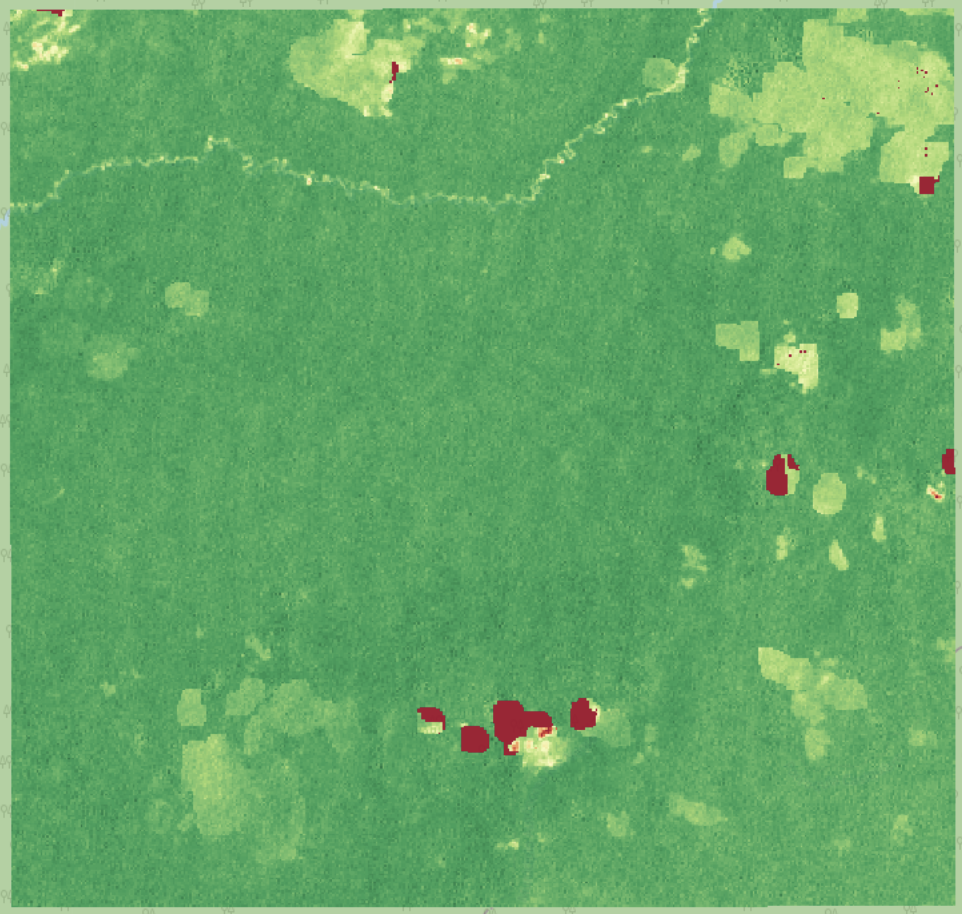

# Deforestation Viewer: NDVI Change Detection (1985–2024)

A lightweight satellite analysis pipeline for monitoring vegetation change using **Landsat (5/7/8/9)** and **Sentinel-2** imagery through the **Microsoft Planetary Computer API**.  
The system computes yearly **NDVI (Normalized Difference Vegetation Index)** composites and visualizes deforestation trends in an interactive Streamlit map.

---

## Features

- Processes **Landsat 5–9** and **Sentinel-2** scenes from 1985–2024  
- Computes NDVI using dataset-specific scale and offset values  
- Masks clouds, water, snow, and shadows using QA and SCL bands  
- Outputs **Cloud-Optimized GeoTIFF (COG)** composites per year  
- Visualizes NDVI and ΔNDVI (change) in a **Streamlit dashboard**  
- Streams imagery efficiently via the Planetary Computer — minimal local storage required  

---

## Tech Stack

**Language:** Python  
**Core Libraries:** Dask, StackSTAC, Xarray, RioXarray, Rasterio, GeoPandas, NumPy  
**Visualization:** Streamlit, Leafmap, Matplotlib  
**Data Source:** Microsoft Planetary Computer STAC API

---

## Directory Overview

```
deforestation-viewer/
├── data/
│   ├── aoi/                # AOI GeoJSON files
│   ├── composites/         # NDVI output rasters
│   └── change/             # ΔNDVI difference layers
├── src/
│   ├── search_download.py  # NDVI composite generator
│   ├── ndvi.py             # NDVI computation & masking
│   └── streamlit_app.py    # Visualization interface
└── docs/                   # Documentation for MkDocs
```

---

## Example Output

| Year | Observation |
|------|--------------|
| **1995** | Dense vegetation with minimal disturbance |
| **2002** | Visible clearing in northern region |
| **2021** | Significant NDVI decline due to deforestation |

<p align="center">
  
  
  
</p>
<p align="center">
  <em>NDVI change progression — 1995 → 2002 → 2021</em>
</p>

---


