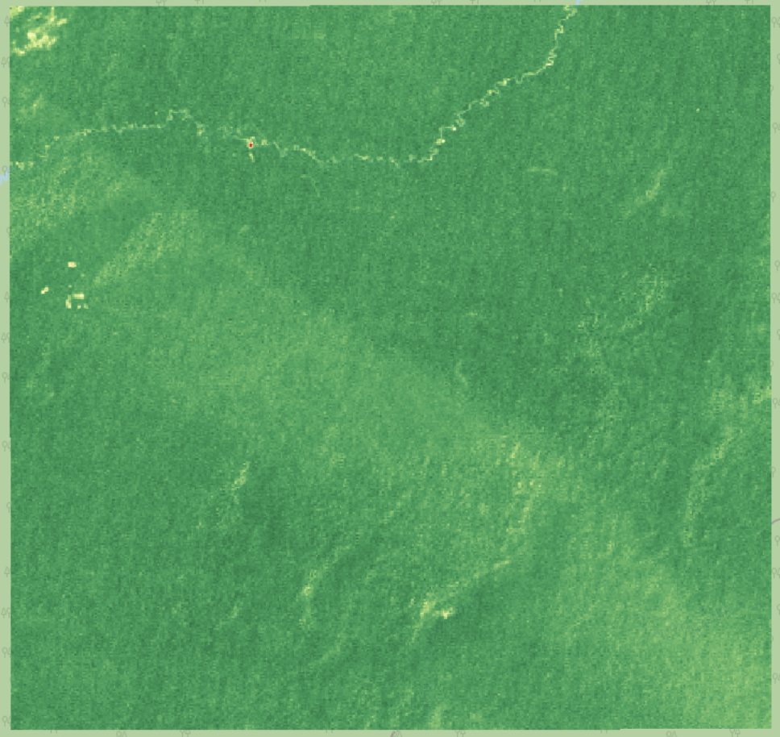
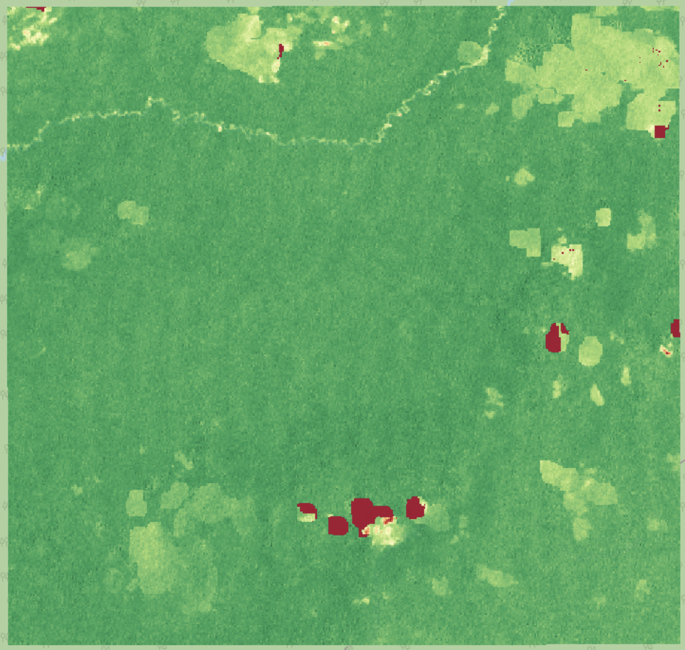
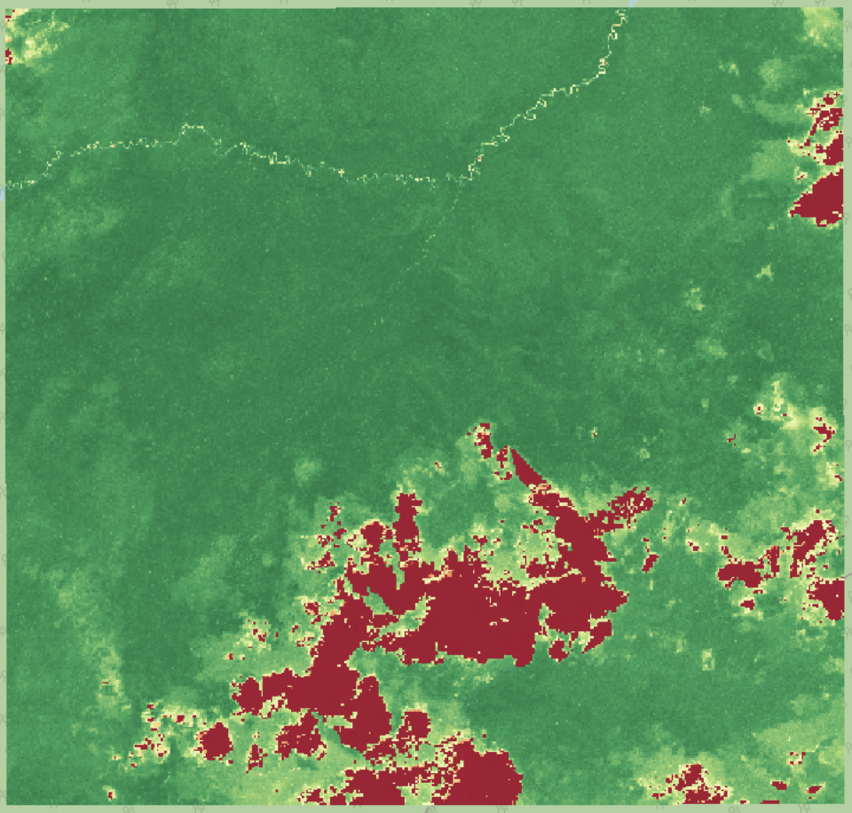

# Deforestation Viewer — NDVI Change Detection (1985–2024)

A lightweight Python pipeline for analyzing long-term vegetation change using **Landsat (5/7/8/9)** and **Sentinel-2** imagery via the **Microsoft Planetary Computer API**.  
The system computes yearly **NDVI (Normalized Difference Vegetation Index)** composites and visualizes forest loss or regrowth through a **Streamlit** dashboard.

---

## Overview

**Purpose:** Detect and visualize deforestation trends using satellite imagery from 1985–2024.  
**Output:** Annual NDVI composites and ΔNDVI (change) layers stored as Cloud-Optimized GeoTIFFs (COGs).  
**Visualization:** Interactive map built with Streamlit and Leafmap.

---

## Quick Start

### 1. Clone the Repository

```bash
git clone https://github.com/CryoAether/deforestation-viewer.git
cd deforestation-viewer
```

### 2. Set Up the Environment

```bash
conda create -n deforest python=3.11
conda activate deforest
pip install -r requirements.txt
```

### 3. Run a Small NDVI Test

Using the included example AOI:

```bash
MAX_SCENES=6 MAX_CLOUD=80 WINDOW_WEEKS=8 DAY_GAP=10 python src/search_download.py
```

Outputs will appear under `data/composites/`.

### 4. Launch the Streamlit App

```bash
streamlit run src/streamlit_app.py
```

Use the controls to view yearly NDVI or compare change between two years.

---

## Example Results

| Year | Observation |
|------|--------------|
| **1995** | Dense canopy, minimal disturbance |
| **2002** | Patchy clearing in northern section |
| **2021** | Widespread NDVI loss, visible deforestation |

<p align="center">
  
  
  
</p>
<p align="center">
  <em>NDVI change progression — 1995 → 2002 → 2021</em>
</p>

---

## Documentation Sections

- [Installation & Setup](install.md)
- [Creating a Custom AOI](create_aoi.md)
- [NDVI Processing Pipeline](search_download.md)
- [NDVI Computation & Masking](ndvi.md)
- [Streamlit Visualization](streamlit.md)
- [Troubleshooting & Error Fixes](troubleshooting.md)
