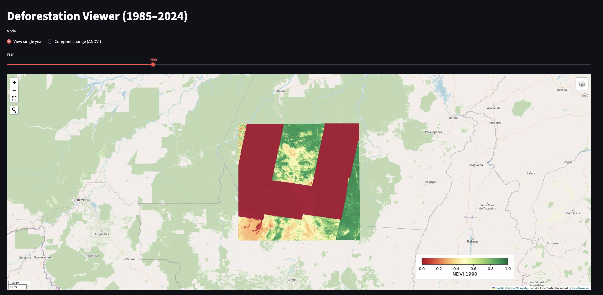
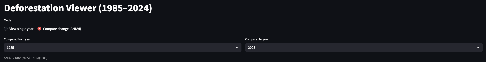

# 🌿 Streamlit App Guide — Deforestation Viewer

This page explains how to run the Streamlit map, compare years, tune the visualization, and adjust code paths when needed.

What it does:  
Renders yearly NDVI composites and an interactive change layer (ΔNDVI) over your AOI using a Leaflet map inside Streamlit.

## 1) Quick Start

### Prerequisites

- You have generated NDVI composites with `src/search_download.py`. (Output files live in `data/composites/ndvi_median_<YEAR>.tif`.)
- Your AOI is in `data/aoi/roi.geojson` with CRS EPSG:4326.

### Run
Be sure you're in the repo root and run:
`streamlit run src/streamlit_app.py`
The app will auto-discover raster files in data/composites/ and list the years.

## 2) Using the App

### Modes

You can switch modes at the top:  
- **View single year** 
A slider selects one year. The app displays NDVI <year> with a green to red scale.
  - Green ~ healthy vegetation
  - Red ~ low vegetation or disturbance
- **Compare change (ΔNDVI)**
- Choose From year and To year. The app computes a difference raster on the fly:
`\Delta \text{NDVI} = \text{NDVI}(\text{To}) - \text{NDVI}(\text{From})`
  - Positive values indicate greening. Negative values indicate loss.

### Map Basics
- Basemap: Esri.WorldImagery (high-res satellite context).
- Map centers on your AOI centroid if available.
- Use the layer control to toggle layers.

## 3) Getting the Most Out of It

**Pick useful year pairs**
- Try 2016 → 2020, 2000 → 2021, or pre-event vs post-event periods.
- Narrow geographic AOIs for fast interaction.

**Normalize change smartly**
